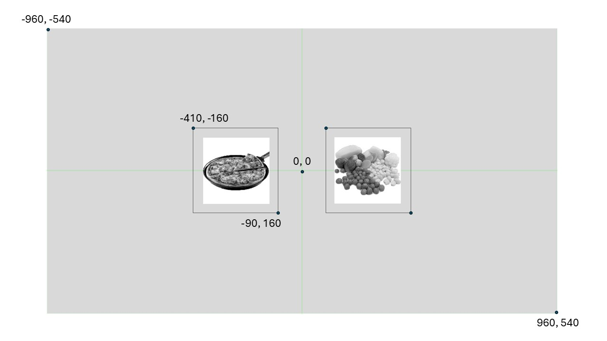
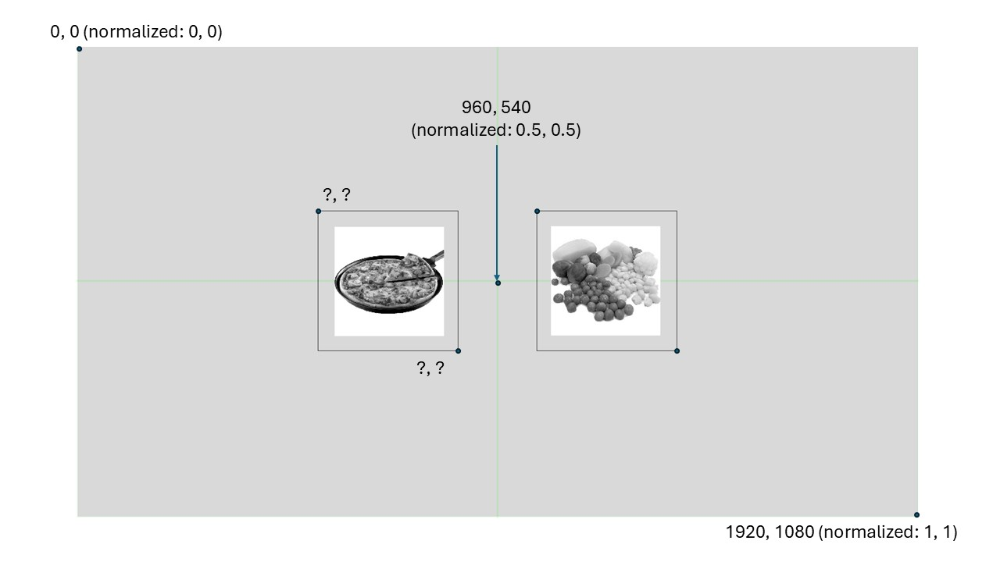

```{r package, include=FALSE, echo=FALSE}
# install package librarian if needed
if (!("librarian" %in% rownames(installed.packages()))) {
  install.packages("librarian")
}

# install / load required packages
librarian::shelf(
  dplyr,
  readr,
  ggExtra,
  tidyverse,
  hrbrthemes,
)

#install gar parser package for Windows
if (!("gar" %in% rownames(installed.packages()))) {
  install.packages("../parser/gar_0.3.0.zip", repos = NULL, type = "win.binary")
}
library(gar)

#install gar parser package for MacOS
# if (!("gar" %in% rownames(installed.packages()))) {
#   install.packages("../parser/gar_0.3.0.tar.gz", repos = NULL, type = "source")
# }
# library(gar)

```

# Call for each participant data

The raw data folder contains one subfolder for students data (Students_participants) and another one for participants data (Guest_participants).

IMPORTANT

FOR EACH PARTICIPANT DATA, DEFINE THE GROUP (Guest or Students), COMPUTER NUMBER AND GAZE FILE NAME OF THE PARTICIPANT BY CHANGING THE FOLLOWING JUNK.

For example:

Guest participant on November 6, seated on Computer 14

date \<- "06.11.2024"

group \<- "Guest"

computer_number \<- "14"

gaze_data_file \<- "[Copy-paste the name of the gaze file of the participant]"

```{r}
# Change the following values for each participant
date <- "06.11.2024"
group <- "Students"
computer_number <- "07" #put a zero before single digit
gaze_data_file <- "20241106T122516_PSY-NEUROSOZ-07_CET_7_gaze.csv"

```

```{r}
#Define the relative paths
RawMainDir <- "../raw data"
PreprocessMainDir <- "../preprocessed data"
PartSubDir <- paste(group, "_participants", sep="")
part_ID <- paste(group, computer_number, sep="")

```

# Preprocessing of eye-tracking raw data

## Set parser parameters

Get the default parser parameters from the library, adjust the parameters and define the screen size of the participant computer.

More information about the R package that implements the bindings to the gaze analysis library gac can be found on this GitHub repository: <https://github.com/humdek-unibe-ch/gar-gaze_analysis_r>.

```{r parser parameters}
# get the default parameters from the library
params <- gar_get_filter_parameter_default()

# adjust the filter parameters
params$gap$max_gap_length <- 50
params$gap$sample_period <- 1000/60
params$noise$mid_idx <- 1
params$saccade$velocity_threshold <- 20
params$fixation$duration_threshold <- 100
params$fixation$dispersion_threshold <- 0.5

#define screen resolution
screen_res_X = 1920 #
screen_res_Y = 1080 #

# define screen normalized size
screen_X_max = 1 # X normalised data
screen_X_min = 0 # X normalised data
screen_Y_max = 1 # Y normalised data
screen_Y_min = 0 # Y normalised data

```

## Filter participant raw data

Filter the data to only include gaze samples that (1) are valid, (2) are drift compensated, (3) are inside the computer screen, and (4) occurred during the presentation of the pictures (label = "Pictures_Onset").

```{r load raw data, warning=FALSE, message=FALSE}
#load participant raw data
setwd (file.path(RawMainDir,PartSubDir))
d_raw <- read_csv(gaze_data_file)

d_raw
```

```{r filter valid data}

#Check if you have unvalid fixations
unique(d_raw$combined_gazePoint2d_isValid)

#Drop unvalid gaze samples   
d_raw_valid <- subset(d_raw, combined_gazePoint2d_isValid == TRUE)

#Check your filter data
unique(d_raw_valid$combined_gazePoint2d_isValid)
```

```{r filter fixations inside the screen}

#Check the range positions of all fixations on the x and y coordinates.  
range(d_raw_valid$combined_gazePoint2dCompensated_x)
range(d_raw_valid$combined_gazePoint2dCompensated_y)

# since sx and sy should be the normalized x/y coordinates of the 2d gaze point, everything >0 and <1 should be on the screen and everything else should be excluded

# Drop drift-compensated fixations outside the screen        
d_valid_screen <- subset(
  d_raw_valid,
  combined_gazePoint2dCompensated_x > screen_X_min &
    combined_gazePoint2dCompensated_x < screen_X_max &
    combined_gazePoint2dCompensated_y > screen_Y_min &
    combined_gazePoint2dCompensated_y < screen_Y_max
) 

#Check your filter data
range(d_valid_screen$combined_gazePoint2dCompensated_x)
range(d_valid_screen$combined_gazePoint2dCompensated_y)
```

```{r filter fixations during the interest time period}

#Check your logged messages
unique(d_valid_screen$label)

#filter the data to only include fixations during the presentation of the pictures
d <- subset(d_valid_screen, label == "Pictures_Onset") #

#Check your filter data
unique(d$label)
```

## Run parser on participant raw data

Pass the participant data to the parser. This procedure results in 3 data tables, including a fixation table that detected all fixations with the I-DT algorithm (Salvucci & Goldberg 2000).

```{r run parser}

# Initialise the gaze analysis handler with the modified parameter structure
handler <- gar_create(params)

#Set trial ID as integer
d$trial_id<-as.integer(d$trial_id)

# Pass the participant data to the parser
res <- gar_parse(handler,
  d$combined_gazePoint3dCompensated_x,
  d$combined_gazePoint3dCompensated_y,
  d$combined_gazePoint3dCompensated_z,
  d$combined_originPoint3d_x,
  d$combined_originPoint3d_y,
  d$combined_originPoint3d_z,
  d$combined_gazePoint2dCompensated_x,
  d$combined_gazePoint2dCompensated_y,
  d$timestamp_relative,
  d$trial_id,
  d$label
)

# Separate the fixation table from other results
Data_fix <- (res$fixations)
Data_fix$subject_nr <- computer_number
```

## Create AOIs

Create AOIs for the left and right pictures.



On OpenSesame, the screen coordinates are \#(min: -960,-540; max: 960,540). We define AOIs with two rectangles surrounding the left and right pictures.

```{r define AOIs coordinates for OpenSesame}

#define screen coordinates on OpenSesame
OS_min_screen_X <- -(screen_res_X/2) #
OS_max_screen_X <- screen_res_X/2 #
OS_min_screen_Y <- -(screen_res_Y/2) #
OS_max_screen_Y <- screen_res_Y/2 #

#define AOI coordinates for the left picture on OpenSesame
OS_min_left_X <- -410 #
OS_max_left_X <- -90#
OS_min_left_Y <- -160#
OS_max_left_Y <- 160#

#define AOI coordinates for the right picture on OpenSesame
OS_min_right_X <- 90#
OS_max_right_X <- 410#
OS_min_right_Y <- -160#
OS_max_right_Y <- 160#

```

The eye-tracker used normalized coordinates to indicate gaze samples positions. Hence, we need to convert our AOIs coordinates in normalized ones.



```{r define AOIs in normalized coordinates and create an AOI_visited variable}

#Convert in normalized coordinates for the left AOI (screen: min=0,0; max=1,1) 
norm_min_left_X <- (OS_min_left_X + OS_max_screen_X)/ screen_res_X
norm_max_left_X <- (OS_max_left_X + OS_max_screen_X)/ screen_res_X
norm_min_left_Y <- (OS_min_left_Y + OS_max_screen_Y)/ screen_res_Y
norm_max_left_Y <- (OS_max_left_Y + OS_max_screen_Y)/ screen_res_Y

norm_min_right_X <- (OS_min_right_X + OS_max_screen_X)/ screen_res_X
norm_max_right_X <- (OS_max_right_X + OS_max_screen_X)/ screen_res_X
norm_min_right_Y <- (OS_min_right_Y + OS_max_screen_Y)/ screen_res_Y
norm_max_right_Y <- (OS_max_right_Y + OS_max_screen_Y)/ screen_res_Y

#Create a column indicating the AOI visited by the fixation (NA if the fixation was outside the AOIs)
Data_fix <- dplyr::mutate(Data_fix, AOI_visited = case_when(
  sx >= norm_min_left_X & sx <= norm_max_left_X & sy >= norm_min_left_Y & sy <= norm_max_left_Y ~ 'Left', 
  sx >= norm_min_right_X & sx <= norm_max_right_X & sy >= norm_min_right_Y & sy <= norm_max_right_Y ~ 'Right')) #
```

## Data check by plot

Get an overview of the pre-processed data for checking of data quality.

```{r data check, warning=FALSE}
range(Data_fix$trial_id) #ask which variables they want to check
range(Data_fix$duration)
range(Data_fix$trial_onset)
range(Data_fix$sx)
range(Data_fix$sy)
unique(Data_fix$label)
```

Create a plot showing the position of each fixation made by the participant during the all experiment.

Fixations located in the AOI on the upper side of the screen are colored green. Fixations located in the AOI on the lower side of the screen are colored blue. Fixations outside the AOIs are colored grey.

```{r data check plot, warning=FALSE}

# create a ggplot2 scatterplot per AOI
p <- Data_fix %>%
  ggplot( aes(x=sx, y=sy), color=AOI_visited) +
  geom_point(aes(colour=AOI_visited), size=1, alpha=1) +
  theme_ipsum() +
  xlim(0,1)+
  ylim(1,0)+
  scale_colour_manual(values=c("blue", "cyan4")) 
p

```

# Pre-processing of behavioral raw data

## Load behavioral raw data for each participant

Load the behavioral raw data for each participant thanks to computer_number and date defined at the beginning of the script.

```{r load data, warning=FALSE}

setwd (file.path(RawMainDir,PartSubDir))
Data_behav <- read.csv(file=paste("PSY-NEUROSOZ-",computer_number,"_", date,".csv",sep=""))

```

## Filter and prepare behavioral data

Select the variables of interest for behavioral measures and remove practice trials.

```{r message=FALSE}

Behav_data <- Data_behav %>% # ask them the variables of interest
  select(
    subject_nr,
    fat_craving,
    sugar_craving,
    Trial_ID,
    Block,
    practice,
    Arrow_Direction,
    Arrow_Position,
    Congruence,
    Left_Picture,
    Right_Picture,
    Pair_Number,
    response,
    response_time
  ) %>%
  subset(practice == "no") 

```

Rename columns and cases.

```{r}

#Rename trial_id variable to match with our Data_fix dataset
names(Behav_data)[names(Behav_data) == "Trial_ID"] <- "trial_id"

#Convert uppercase letters of "Arrow_Direction" cases in lowercase to match with "response" cases
Behav_data$Arrow_Direction<-tolower(Behav_data$Arrow_Direction)

#Set trial ID and subject_nr as integers
Behav_data$trial_id<-as.integer(Behav_data$trial_id)
Behav_data$subject_nr<-as.integer(Behav_data$subject_nr)

```

Create a variable indicating whether participants respond correctly or not to the probe.

```{r accuracy variable}

#create dummy variable for accuracy (1 for correct response, 0 for incorrect response)
Behav_data <- Behav_data %>%
  mutate(accuracy = if_else(response == Arrow_Direction, 1, 0) #
  )  
```

## Get an overview of your behavioral variables

```{r}
unique(Behav_data$fat_craving)
unique(Behav_data$sugar_craving)
range(Behav_data$trial_id)
range(Behav_data$Pair_Number)
unique(Behav_data$subject_nr) #correspond to computer number
range(Behav_data$Block)
unique(Behav_data$Left_Picture)
unique(Behav_data$Right_Picture)
range(Behav_data$response_time)
range(Behav_data$accuracy)
unique(Behav_data$Congruence)
unique(Behav_data$practice)
```

# Merge gaze and behavioral data

Merge all the data of the participant, with one row per fixation.

```{r merge data}

All_Data <- merge(Data_fix, Behav_data, by = "trial_id")
```

Rename AOIs by the type of pictures presented (Healthy, Sugary, Salty).

```{r rename AOI}

#rename Left and Right AOI by the type of food presented (Salty, Sugary and Healthy) 
All_Data$AOI_visited[All_Data$AOI_visited == "Left" & All_Data$Left_Picture == 'FF'] <- "Salty"
All_Data$AOI_visited[All_Data$AOI_visited == "Left" & All_Data$Left_Picture == 'FL'] <- "Healthy"
All_Data$AOI_visited[All_Data$AOI_visited == "Left" & All_Data$Left_Picture == 'FS'] <- "Sugary"

All_Data$AOI_visited[All_Data$AOI_visited == "Right" & All_Data$Right_Picture == 'FF'] <- "Salty"
All_Data$AOI_visited[All_Data$AOI_visited == "Right" & All_Data$Right_Picture == 'FL'] <- "Healthy"
All_Data$AOI_visited[All_Data$AOI_visited == "Right" & All_Data$Right_Picture == 'FS'] <- "Sugary"

unique(All_Data$AOI_visited)
```

## Create individual gaze plots for data quality check

Create two gaze plots showing fixations made by the participant for each trial showing salty or sugary food.

Fixations are represented by dots, with bigger dots indicating longer fixation duration.

Fixations on healthy food are colored green. Fixations on salty or sugary food are colored red. Fixations outside the AOIs are colored grey.

### Gaze plot for salty trials

```{r salty trials fixation plot, warning=FALSE}
# Filter data to include only trials where Salty food is in Left_Picture or Right_Picture
Salty_Data <- All_Data %>%
  filter(Left_Picture == "FF" | Right_Picture == "FF")

# Extract craving values
salty_food_craving <- unique(Salty_Data$fat_craving)

# create a ggplot per trial
p_salty_trial <- Salty_Data %>%
  ggplot( aes(x=sx, y=sy), color=AOI_visited) +
  geom_point(aes(fill=AOI_visited, size=duration), alpha=0.3, shape=21) +
  geom_point(aes(x=0.5, y=0.5), colour="black", shape=3) +
  theme_ipsum() +
  xlim(1,0)+
  ylim(1,0)+
  facet_wrap(~ trial_id, ncol=8, labeller=label_both)+
  scale_fill_manual(values=c("green", "red"))+
  ggtitle(paste("Participant:", part_ID, "- Salty food Craving:", salty_food_craving)) +
  theme(axis.text.x=element_blank(), #remove x axis labels
        axis.ticks.x=element_blank(), #remove x axis ticks
        axis.title.x = element_blank(), #remove x axis title
        axis.text.y=element_blank(),  #remove y axis labels
        axis.ticks.y=element_blank(),  #remove y axis ticks
        axis.title.y = element_blank(), #remove y axis title
        panel.grid.major = element_blank(),
        panel.grid.minor = element_blank(),
        panel.border = element_rect(colour="black", fill=NA),
        strip.text = element_text(size = 8.5))
p_salty_trial

```

### Gaze plot for sugary trials

```{r sugary trials fixation plot, warning=FALSE}
# Filter data to include only trials where sugary food is in Left_Picture or Right_Picture
Sugary_Data <- All_Data %>%
  filter(Left_Picture == "FS" | Right_Picture == "FS")

# Extract craving values
sugary_food_craving <- unique(Salty_Data$sugar_craving)

# create a ggplot per trial
p_sugary_trial <- Sugary_Data %>%
  ggplot( aes(x=sx, y=sy), color=AOI_visited) +
  geom_point(aes(fill=AOI_visited, size=duration), alpha=0.3, shape=21) +
  geom_point(aes(x=0.5, y=0.5), colour="black", shape=3) +
  theme_ipsum() +
  xlim(1,0)+
  ylim(1,0)+
  facet_wrap(~ trial_id, ncol=8, labeller=label_both)+
  scale_fill_manual(values=c("green", "red"))+
  ggtitle(paste("Participant:", part_ID, "- Sugary food Craving:", sugary_food_craving)) +
  theme(axis.text.x=element_blank(), #remove x axis labels
        axis.ticks.x=element_blank(), #remove x axis ticks
        axis.title.x = element_blank(), #remove x axis title
        axis.text.y=element_blank(),  #remove y axis labels
        axis.ticks.y=element_blank(),  #remove y axis ticks
        axis.title.y = element_blank(), #remove y axis title
        panel.grid.major = element_blank(),
        panel.grid.minor = element_blank(),
        panel.border = element_rect(colour="black", fill=NA),
        strip.text = element_text(size = 8.5))
p_sugary_trial

```

### Save plots

```{r, warning=FALSE, message=FALSE}
# Check if the main preprocessed directory exists
if (!dir.exists(PreprocessMainDir)) {
  dir.create(PreprocessMainDir) # Create the main directory if it doesn't exist
}

# Check if the subdirectory for plots exists
AllSubDirPlot <- "Each_Part_GazePlot"

if (file.exists(AllSubDirPlot)){
  setwd(file.path(PreprocessMainDir, AllSubDirPlot))
} else {
  dir.create(file.path(PreprocessMainDir, AllSubDirPlot)) # Create the subdirectory if it doesn't exist
  setwd(file.path(PreprocessMainDir, AllSubDirPlot))
  
}

# PNG device
png(filename = paste(part_ID,"_Salty_GazePlot.png"), family = "sans", width = 2000, height = 1000, res=100, pointsize = 5)

p_salty_trial

dev.off()

# PNG device
png(filename = paste(part_ID,"_Sugary_GazePlot.png"), family = "sans", width = 2000, height = 1000, res=100, pointsize = 5)

p_sugary_trial

dev.off()
```

# Data reduction procedure

## Criteria 1: Exclude trials with half of fixations outside AOIs

```{r}
#Count the number of fixations outside AOIs
sum(is.na(All_Data$AOI_visited))

# Count the number of fixations for each AOI_visited value by participant and trial
fixation_counts <- All_Data %>%
  group_by(trial_id) %>%
  summarize(
    Healthy_count = sum(AOI_visited == "Healthy", na.rm = TRUE),
    Salty_count = sum(AOI_visited == "Salty", na.rm = TRUE),
    Sugary_count = sum(AOI_visited == "Sugary", na.rm = TRUE),
    NA_count = sum(is.na(AOI_visited)),
    NA_more_than_sum = NA_count > (Healthy_count + Salty_count + Sugary_count)
  ) %>%
  ungroup()

# Filter out the trials where NA_count is greater than the sum of Money_count and Carbon_count
trials_to_exclude <- fixation_counts %>%
  filter(NA_more_than_sum) %>%
  select(trial_id)

#Count the number of trials to exclude based on this criteria
count(trials_to_exclude)

# Remove these trials from the original dataset
All_Data_cleaned <- All_Data %>%
  anti_join(trials_to_exclude, by = c("trial_id"))
```

## Remove all fixations outside AOIs in the dataset

```{r}
#Count the number of remaining fixations outside AOIs
sum(is.na(All_Data_cleaned$AOI_visited))

#Remove rows with fixations outside AOIs
All_AOI_Data <- All_Data_cleaned[!is.na(All_Data_cleaned$AOI_visited),]
```

# Save merged data per participant in a csv file

```{r warning=FALSE}
#create a folder for merged data for each participant
AllSubDirFix <- "Each_Part_Fix_Outputs"

if (file.exists(AllSubDirFix)){
  setwd(file.path(PreprocessMainDir, AllSubDirFix))
} else {
  dir.create(file.path(PreprocessMainDir, AllSubDirFix))
  setwd(file.path(PreprocessMainDir, AllSubDirFix))
  
}

#add participant number in the dataset
All_AOI_Data <- All_AOI_Data %>%
  mutate(part_ID = part_ID)

#save file for merged behavior and fixation data for each part
write.csv(All_AOI_Data, file = paste(part_ID,"_BEHAVandFIX.csv",sep=""), row.names = FALSE)

```
